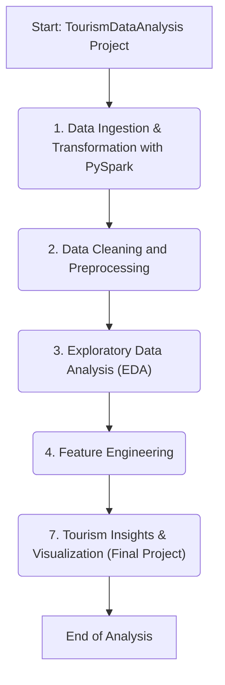

# Report: Tourism Data Analysis Project Workflow

## 1\. Project Overview

This report details the structure of the **`TourismDataAnalysis`** project hosted on GitHub. This project is an end-to-end data analysis workflow implemented entirely in **Jupyter Notebook**. The repository is structured to demonstrate a comprehensive process for analyzing tourism-related data, leveraging PySpark for efficient processing of large datasets.

### Repository Details:

  * **Name**: TourismDataAnalysis
  * **Language**: Jupyter Notebook (100.0%)
  * **Description**: An end-to-end project focused on analyzing tourism data using PySpark to uncover trends, patterns, and insights.
  * **Activity**: The repository has 0 stars, 0 watchers, and 0 forks.
  * **Releases/Packages**: No releases or packages have been published.

## 2\. Analysis Workflow

The project is organized into a sequence of numbered steps, creating a clear and logical pipeline from raw data ingestion to final actionable insights. This step-by-step approach is designed to effectively analyze complex tourism datasets.

1.  **Data Ingestion and Transformation with PySpark**: The workflow begins by loading diverse tourism datasets (e.g., bookings, visitor demographics, location data) into PySpark. This initial phase focuses on transforming raw data into a structured format suitable for analysis using Resilient Distributed Datasets (RDDs) or DataFrames.
2.  **Data Cleaning and Preprocessing**: This critical step involves handling missing values, correcting data types, removing duplicates, and standardizing formats (like dates and locations). The objective is to ensure the dataset is clean, accurate, and reliable for analysis.
3.  **Exploratory Data Analysis (EDA)**: An initial investigation is conducted to understand the data's main characteristics. This includes analyzing booking trends, identifying the most popular destinations, examining peak travel seasons, and understanding visitor demographics.
4.  **Feature Engineering**: New, insightful features are created from the existing data to enhance the analysis. Examples include calculating 'length of stay' from check-in/check-out dates or deriving 'travel season' (e.g., Peak, Off-Season) from timestamps.
5.  **Tourism Insights and Visualization (Final Project)**: The workflow culminates in a final analysis that synthesizes all findings. This step focuses on answering key questions, such as identifying the main drivers of destination popularity or predicting future booking trends, and presenting these insights through compelling visualizations.

## 3\. Workflow Flowchart

The following flowchart visualizes the sequential process laid out for the tourism data analysis.

